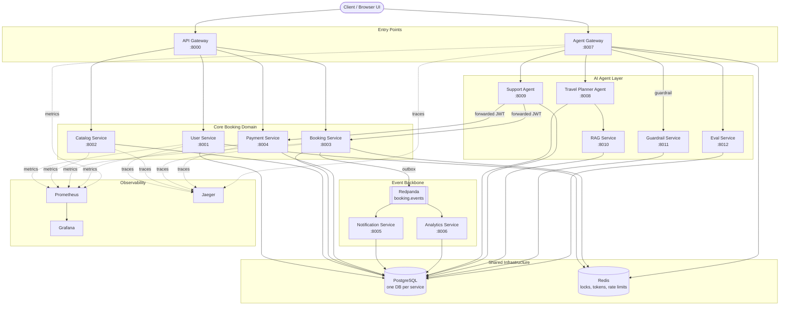
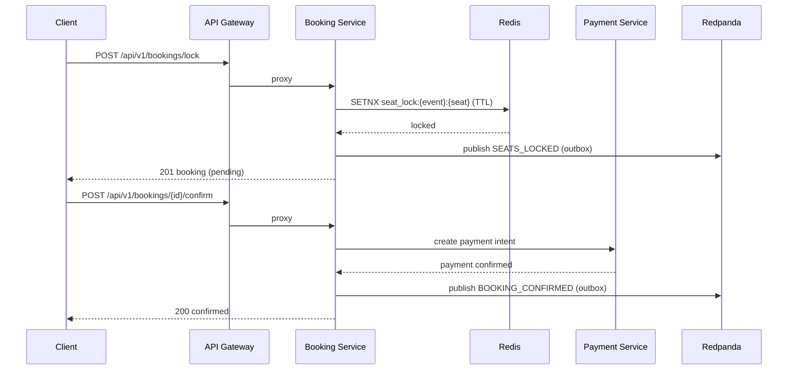

# TicketFlow

[](.github/workflows/ci.yml)
[](#prerequisites)
[](#tech-stack)
[](#service-catalog)
[](k8s/)

A production-shaped **microservices event-booking platform**: 13 independently deployable FastAPI services covering core booking, an async event backbone, and a full AI agent layer — plus the observability, load-test, chaos-test, CI, and Kubernetes tooling that go with running it for real.

---

## Table of Contents

- [Project Overview](#project-overview)
- [Architecture](#architecture)
- [Service Catalog](#service-catalog)
- [Tech Stack](#tech-stack)
- [Prerequisites](#prerequisites)
- [Quick Start (Docker Compose)](#quick-start-docker-compose)
- [Manual Setup (Phase 1 core services)](#manual-setup-phase-1-core-services)
- [Environment Variables](#environment-variables)
- [API Overview](#api-overview)
- [Observability](#observability)
- [Running Tests](#running-tests)
- [CI/CD](#cicd)
- [Load & Chaos Testing](#load--chaos-testing)
- [Kubernetes Deployment](#kubernetes-deployment)
- [Browser UI](#browser-ui)
- [Project Structure](#project-structure)
- [Security](#security)
- [Notes & Known Issues](#notes--known-issues)

---

## Project Overview

TicketFlow lets users browse events, lock and book seats, and pay for them — fronted by a single API gateway, with every domain owned by its own service and its own database. On top of that sits an event backbone (booking emits domain events over Kafka-compatible Redpanda) and a six-service AI agent layer (chat-based trip planning, support/refund handling, RAG, guardrails, and eval tracing).

**Highlights:**
- JWT auth (access + refresh) with Redis-backed refresh-token revocation
- Redis seat locking (TTL-based) to prevent double-booking
- Outbox-pattern event publishing to Redpanda, consumed idempotently downstream
- Async throughout — SQLAlchemy 2.0 async, asyncpg, `redis[asyncio]`
- Field-level Fernet encryption for user PII (`full_name`, `phone`)
- Structured JSON logging (`structlog`) + a consistent error envelope
- Full observability stack (Prometheus, Grafana, Jaeger) and a Locust load-test harness with real captured results
- CI matrix testing all 13 services independently; Kubernetes manifests for every service

---

## Architecture



### Request flow (booking)



---

## Service Catalog

| # | Service | Port | Database | Core Domain |
|---|---|---|---|---|
| 1 | `gateway` | 8000 | — | Single entry point: routing, JWT auth, CORS |
| 2 | `user-service` | 8001 | `ticketflow_users` | Registration, login, JWT, refresh-token revocation |
| 3 | `catalog-service` | 8002 | `ticketflow_catalog` | Events, venues, categories, seat inventory |
| 4 | `booking-service` | 8003 | `ticketflow_booking` | Reservations, Redis seat locks, outbox events |
| 5 | `payment-service` | 8004 | `ticketflow_payment` | Payment intents, refunds, webhooks |
| 6 | `notification-service` | 8005 | `ticketflow_notification` | Consumes `booking.events`, stub notifications |
| 7 | `analytics-service` | 8006 | `ticketflow_analytics` | Consumes `booking.events`, exposes `/stats` |
| 8 | `agent-gateway` | 8007 | shared | Chat entry point: guardrail → intent → route → guardrail → trace |
| 9 | `travel-planner-agent` | 8008 | shared | Multi-turn constraint gathering → itinerary (RAG-backed) |
| 10 | `support-agent` | 8009 | shared | Booking inquiry / refund via booking-service & payment-service |
| 11 | `rag-service` | 8010 | `rag-postgres` (pgvector) | Vector search over destination/policy content |
| 12 | `guardrail-service` | 8011 | shared | Prompt-injection + PII detection/redaction |
| 13 | `eval-service` | 8012 | shared | One trace per gateway conversation turn |

Infra containers: PostgreSQL (`:5440` app DBs, `:5434` `rag-postgres`), Redis (`:6379`), Redpanda (`:9092`, console `:8080`), Prometheus (`:9090`), Grafana (`:3000`), Jaeger UI (`:16686`).

---

## Tech Stack

- **Language/Runtime:** Python 3.12, fully async
- **Web framework:** FastAPI + Uvicorn
- **Data:** SQLAlchemy 2.0 (async) + asyncpg, Alembic migrations, PostgreSQL 15 (pgvector for RAG)
- **Caching / locks:** Redis (`redis[asyncio]`), TTL-based seat locks, refresh-token revocation
- **Messaging:** Redpanda (Kafka-wire-compatible), outbox pattern + idempotent consumers
- **Auth/security:** PyJWT, bcrypt, Fernet field-level encryption, HMAC-verified payment webhooks, shared-secret internal mesh auth
- **Observability:** structlog (JSON logs), Prometheus metrics, Jaeger tracing, Grafana dashboards
- **Testing:** pytest, pytest-asyncio, httpx `ASGITransport`, fakeredis, Locust (load), custom chaos scripts
- **Delivery:** Docker Compose (dev), Kubernetes manifests (`k8s/`), GitHub Actions CI matrix

---

## Prerequisites

| Tool | Version | Notes |
|---|---|---|
| Docker + Docker Compose | recent | Easiest way to run the full 13-service stack |
| Python | 3.12+ | Only needed for manual/non-containerized runs |
| PostgreSQL | 15+ | Only needed for manual runs (Compose provides it) |
| Redis | 7+ | Only needed for manual runs (Compose provides it) |

---

## Quick Start (Docker Compose)

The fastest way to see the whole system running — core services, event backbone, agents, and observability — is a single command:

```powershell
Copy-Item .env.example .env
docker compose up -d --build
```

Then:

- API Gateway docs: http://localhost:8000/docs
- Agent Gateway (chat) docs: http://localhost:8007/docs
- Browser UI: open `ui/index.html` directly (see [Browser UI](#browser-ui))
- Redpanda Console: http://localhost:8080
- Grafana: http://localhost:3000 · Prometheus: http://localhost:9090 · Jaeger: http://localhost:16686

Seed sample catalog data:

```powershell
python scripts/seed_data.py
```

Stop everything:

```powershell
docker compose down
```

---

## Manual Setup (Phase 1 core services)

For working on just the four core services outside Docker (faster reload loop):

### 1. Configure environment

```powershell
Copy-Item .env.example .env
# edit .env — especially JWT_SECRET_KEY
```

### 2. Create databases

```powershell
psql -h localhost -p 5433 -U ticketflow -c "CREATE DATABASE ticketflow_users;"
psql -h localhost -p 5433 -U ticketflow -c "CREATE DATABASE ticketflow_catalog;"
psql -h localhost -p 5433 -U ticketflow -c "CREATE DATABASE ticketflow_booking;"
psql -h localhost -p 5433 -U ticketflow -c "CREATE DATABASE ticketflow_payment;"
```

### 3. Run Alembic migrations (per service)

```powershell
foreach ($svc in "user-service","catalog-service","booking-service","payment-service") {
    Push-Location "services\$svc"
    alembic upgrade head
    Pop-Location
}
```

### 4. Start services

```powershell
.\start_all.ps1    # starts Redis + the 4 core services + gateway, each in its own terminal
.\stop_all.ps1      # stops them
```

Or individually:

```powershell
$env:PYTHONPATH = (Get-Location)
cd services\user-service;    uvicorn app.main:app --port 8001 --reload
cd services\catalog-service; uvicorn app.main:app --port 8002 --reload
cd services\booking-service; uvicorn app.main:app --port 8003 --reload
cd services\payment-service; uvicorn app.main:app --port 8004 --reload
cd services\gateway;         uvicorn app.main:app --port 8000 --reload
```

### 5. Bring up the AI agent layer on top

```powershell
docker compose up -d postgres rag-postgres redis
.\start_phase3.ps1
```

The 6 agent services run as bare `uvicorn --reload` processes so they can reach the host-run Phase 1 services on `localhost`. Entry point: http://localhost:8007/docs.

> No real LLM/API key is used anywhere in the agent layer — intent classification, constraint extraction, itinerary generation, prompt-injection/PII detection, and hallucination checking are deterministic regex/heuristic Python, documented as such in each service.

---

## Environment Variables

Copy `.env.example` to `.env` and fill in your values.

| Variable | Default / Example | Description |
|---|---|---|
| `POSTGRES_HOST` | `localhost` | PostgreSQL host |
| `POSTGRES_PORT` | `5433` / `5440` (Compose) | PostgreSQL port |
| `POSTGRES_USER` | `ticketflow` | PostgreSQL username |
| `POSTGRES_PASSWORD` | `ticketflow123` | PostgreSQL password |
| `REDIS_URL` | `redis://localhost:6379` | Redis connection URL |
| `JWT_SECRET_KEY` | *(change this!)* | Signs JWTs — min 32 chars |
| `JWT_ALGORITHM` | `HS256` | JWT signing algorithm |
| `JWT_ACCESS_TOKEN_EXPIRE_MINUTES` | `15` | Access token lifetime |
| `JWT_REFRESH_TOKEN_EXPIRE_DAYS` | `7` | Refresh token lifetime |
| `USER_SERVICE_URL` / `CATALOG_SERVICE_URL` / `BOOKING_SERVICE_URL` / `PAYMENT_SERVICE_URL` | `http://localhost:800x` | Internal service URLs |
| `PAYMENT_WEBHOOK_SECRET` | *(change this!)* | Verifies payment webhooks (HMAC) |
| `INTERNAL_SHARED_SECRET` | *(change this!)* | Shared secret required on all internal mesh calls |
| `FERNET_KEY` | *(change this!)* | Field-level encryption key for PII columns |
| `SEAT_LOCK_TTL_SECONDS` | `300` | Seconds a seat is held before releasing |
| `MAX_SEATS_PER_BOOKING` | `10` | Max seats per booking |

> **Security note:** rotate `JWT_SECRET_KEY`, `PAYMENT_WEBHOOK_SECRET`, `INTERNAL_SHARED_SECRET`, and `FERNET_KEY` before any real deployment. `k8s/*-secret.yaml` ships with `CHANGE_ME_IN_PROD` placeholders for exactly this reason.

---

## API Overview

All core endpoints are reachable through the **API Gateway** at `http://localhost:8000` (docs: `/docs`); chat/agent endpoints go through the **Agent Gateway** at `http://localhost:8007` (docs: `/docs`).

### User Service (`/users`)

| Method | Path | Auth | Description |
|---|---|---|---|
| POST | `/users/register` | None | Register a new user |
| POST | `/users/login` | None | Login, returns access + refresh JWT |
| POST | `/users/refresh` | Refresh | Obtain a new access token |
| POST | `/users/logout` | Bearer | Revoke refresh token |
| GET/PATCH | `/users/me` | Bearer | Get/update current user profile |

### Catalog Service (`/catalog`)

| Method | Path | Auth | Description |
|---|---|---|---|
| GET | `/catalog/events` | None | List/search events |
| GET | `/catalog/events/{id}` | None | Get event details |
| POST/PATCH/DELETE | `/catalog/events/{id}` | Admin | Manage events |
| GET | `/catalog/venues` / `/catalog/venues/{id}` | None | List venues / seat map |

### Booking Service (`/bookings`)

| Method | Path | Auth | Description |
|---|---|---|---|
| POST | `/bookings` | Bearer | Create booking + lock seats (Redis) |
| GET | `/bookings` / `/bookings/{id}` | Bearer | List / get bookings |
| DELETE | `/bookings/{id}` | Bearer | Cancel booking, release seats |
| POST | `/bookings/{id}/confirm` | Bearer | Confirm booking after payment |

### Payment Service (`/payments`)

| Method | Path | Auth | Description |
|---|---|---|---|
| POST | `/payments/initiate` | Bearer | Create a payment intent |
| GET | `/payments/{id}` | Bearer | Get payment status |
| POST | `/payments/webhook` | HMAC | Handle payment provider webhooks |
| POST | `/payments/{id}/refund` | Bearer | Request a refund |

### Agent Gateway (`/api/v1/agent`)

| Method | Path | Auth | Description |
|---|---|---|---|
| POST | `/api/v1/agent/chat` | Bearer | Chat entry point — routes to travel-planner or support agent |

---

## Observability

Docker Compose wires up a full trio out of the box:

- **Prometheus** (`:9090`) scrapes metrics from every core/gateway service
- **Grafana** (`:3000`) for dashboards on top of Prometheus
- **Jaeger** (`:16686`) for distributed tracing across the gateway → downstream service hops
- **structlog** JSON logs with a `correlation_id` threaded through every request via the error envelope: `{"error": {"code": "...", "message": "...", "details": {}, "correlation_id": "..."}}`
- **Redpanda Console** (`:8080`) for topic/consumer-lag visibility on `booking.events`

---

## Running Tests

```powershell
# One service
cd services\user-service
pytest tests/ -v

# Every service
pytest services/ -v --tb=short

# With coverage
pytest services/ --cov=app --cov-report=term-missing
```

**Test stack:** `pytest` + `pytest-asyncio`, `fakeredis` (no real Redis needed), `httpx.AsyncClient` + FastAPI's `ASGITransport` for endpoint tests, in-memory/test-DB for persistence tests.

---

## CI/CD

`.github/workflows/ci.yml` runs a matrix job across all 13 services on every push/PR to `main`/`master` — each service gets its own `pip install`, its own `pytest` run, and its own `INTERNAL_SHARED_SECRET`, isolated by `fail-fast: false` so one service's failure doesn't hide another's.

---

## Load & Chaos Testing

`scripts/loadtest/locustfile.py` models one realistic user journey: register/login → browse catalog → lock + confirm/release a seat → check booking status → occasionally hit the support agent for a refund. Full methodology and numbers: [`docs/load-test-results.md`](docs/load-test-results.md).

A follow-up chaos run killed the Redpanda broker mid-load (`docker stop redpanda` for ~5s, 30 concurrent users): **zero visible request failures** on any booking/auth/agent-chat path — booking-service treats the event publish as fire-and-forget from the caller's perspective, so a broker blip doesn't fail a booking. Full results: [`docs/load-chaos-results.md`](docs/load-chaos-results.md).

Two standalone chaos scripts are also available for manual exercising:

```powershell
./scripts/chaos_kill_broker.ps1     # stop/restart Redpanda, watch consumer lag drain
./scripts/chaos_kill_consumer.ps1   # stop/restart notification-service, check for gaps/dupes
```

Real incidents hit (and fixed) while building this — DB-connect retry/backoff on startup, a gateway trailing-slash proxy bug — are written up with root cause, fix, and regression test in [`docs/runbooks.md`](docs/runbooks.md).

---

## Kubernetes Deployment

`k8s/` has a `Deployment` + `ClusterIP` `Service` per app service (28 manifests), shared non-secret config in `configmap.yaml`, and per-service secrets in `<service>-secret.yaml` (placeholder values — replace before applying to a real cluster). Infra containers (Postgres, Redis, Redpanda, Prometheus, Grafana, Jaeger) aren't included; point `configmap.yaml` at managed equivalents or deploy them separately under the same DNS names.

```powershell
kubectl apply -f k8s/
```

See [`k8s/README.md`](k8s/README.md) for details and validation status.

---

## Browser UI

`ui/index.html` is a static, dependency-free browser client that drives the live stack directly (register/login, browse events, lock/confirm a booking, chat with the agent gateway) — open it directly in a browser once the stack is up, no build step required.

---

## Project Structure

```
ticketflow/
├── .env.example                  # Template for environment variables
├── docker-compose.yml            # Full 13-service + infra stack
├── start_all.ps1 / stop_all.ps1  # Phase 1 core services
├── start_phase3.ps1              # AI agent layer
├── docs/                         # Runbooks, load/chaos test results
├── infra/                        # IaC extras
├── k8s/                          # Kubernetes manifests (per-service Deployment/Service)
├── libs/                         # Shared libraries (e.g. resilience/retry)
├── scripts/                      # Seed data, chaos scripts, Locust load tests
├── ui/                           # Static browser UI
│
└── services/
    ├── gateway/               # API Gateway            :8000
    ├── user-service/          # Auth, profiles         :8001
    ├── catalog-service/       # Events, venues          :8002
    ├── booking-service/       # Bookings, seat locks    :8003
    ├── payment-service/       # Payments, refunds       :8004
    ├── notification-service/  # Kafka consumer          :8005
    ├── analytics-service/     # Kafka consumer, /stats  :8006
    ├── agent-gateway/         # Chat entry point        :8007
    ├── travel-planner-agent/  # Trip planning agent     :8008
    ├── support-agent/         # Refund/support agent    :8009
    ├── rag-service/           # Vector search           :8010
    ├── guardrail-service/     # Prompt-injection/PII    :8011
    └── eval-service/          # Conversation trace log  :8012
```

Each service follows the same internal shape: `app/{main,config,database,models,schemas,dependencies}.py`, `app/routers/`, `alembic/` (where it owns a schema), `tests/`.

---

## Security

- JWT access (15 min) + refresh (7 days) tokens; refresh tokens tracked in Redis for revocation, and **reuse of a revoked refresh token revokes its whole token family**
- Field-level Fernet encryption for PII (`full_name`, `phone`)
- HMAC-verified payment webhooks
- Shared-secret internal mesh auth — every internal service call carries an `internal-mesh-secret` header
- Admin role for cross-user booking-history reads
- Guardrail service scans agent chat input/output for prompt-injection and PII, redacting before it's stored or returned

---

## Notes & Known Issues

- `PYTHONPATH` must include the repo root for inter-service shared imports (`start_all.ps1` / `start_phase3.ps1` handle this automatically).
- Seat locks use Redis key pattern `seat_lock:{event_id}:{seat_id}` with a configurable TTL.
- The event backbone (Redpanda + notification/analytics consumers) is **idempotent by design**: a `processed_events` table keyed by event id protects against double-processing, and a failing handler retries 3x before routing to `booking.events.dlq` instead of blocking the partition.
- k8s manifests are validated (YAML-parse clean) but **not deployed against a live cluster** in this repo's history — treat as validated-but-undeployed scaffolding.
- The refund amount is always computed server-side by `support-agent`'s own rules engine (>7 days out = 100%, within 7 days = 50%, within 24h = 0%, event cancelled = 100%) — a user-stated amount is never trusted.
